 

Cyrptocurrencies have grown in popularity and market capitalization as corporations, retail investors, and individual adopt them as means of transactions and as a store of value. Bitcoin, introduced to the world in 2008 was the first cryptocurrency and still the largest as a percentage of market share. However, Ethereum and a host of other coins have been making their way into the mainstream. 

One of the primary concerns that regulators and investors hold is their association with malicious activity. Because transactions are anonymous and decentralized, they became useful for purchasing goods and services on dark web markets like Silk Road. With anonymous transactions came fraud. Since users can't verify who is on the other end of the transaction, people are regularly defrauded. For widespread adoption, this poses a major concern. 

Crypto fraud usually presents itself in a couple of ways. First, when a user makes a transaction on an exchange, they must connect their wallet. If the exchange is hacked, all of the wallets are at risk. This is what happened with Mt. Gox, the largest cyrpto hack of all time. This hack involved 850,000 BTC valued today at ~ 45 billion dollars. Crypto fraud also presents itself in ficticious projects. Founders design projects and raise funds from investors. Many times, these projects end up being fake and the founders route money into their own wallets. It is also critical to note that once a transaction is sent, it cannot be reversed. Transactions are immutable. Unlike when your credit card gets hacked and the bank can provide liability coverage, there is no centralized company backing your ethereum to return your money. This makes security a top priority for crypto users 

The model I have designed adds a safeguard for transferring ethereum and ERC20 tokens. If the model believes the transaction may be fraudelent, it will warn the user before they confirm the transaction. This is similar to your bank sending out a warning that your credit card may have been used for unverified transactions. Ideally, this service would be built into an existing wallet provider. 

ERC20 tokens are tokens that trade on the Ethereum blockchain and follow the ERC20 standard created by Ethereum developers. They are essentially applications that have a currency tied to them which follows a specified template.

- https://en.wikipedia.org/wiki/Mt._Gox
- https://www.forbes.com/sites/jeffkauflin/2018/10/29/where-did-the-money-go-inside-the-big-crypto-icos-of-2017/?sh=7a1267cb261b
- https://ethereum.org/en/developers/docs/standards/tokens/erc-20/

----------
The data originally came from Kaggle and be viewed [here](https://www.kaggle.com/vagifa/ethereum-frauddetection-dataset)

**Fraud**
- Interpreting fraud as the wallet's owner has reported a fraudulent transaction at least once

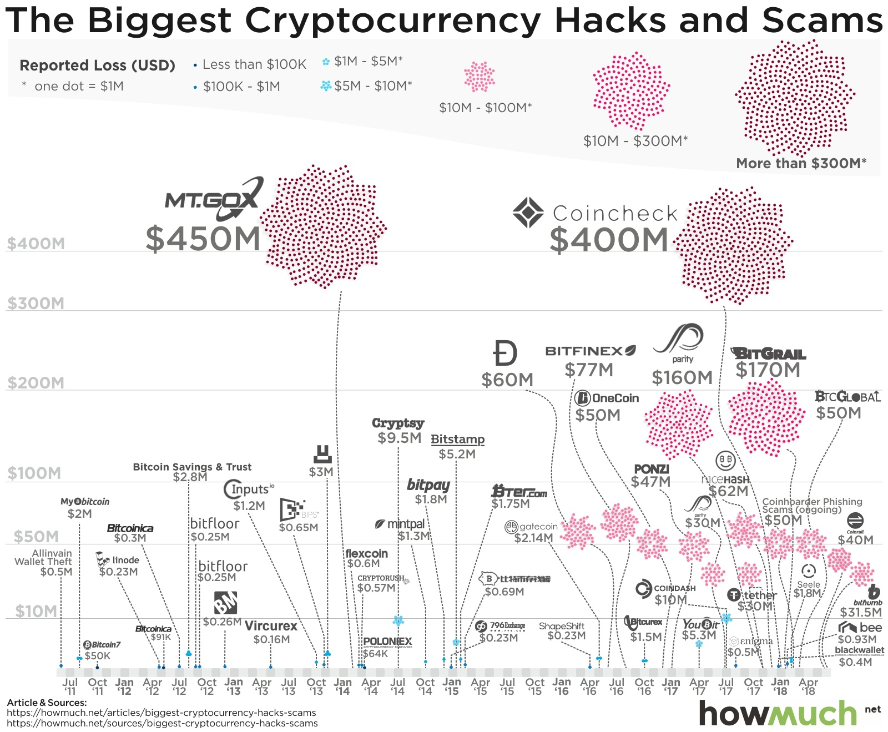  

-------
## Feature Engineering

An example of fraud could be a bad actor gaining access to your wallet and sending the balance or certain number of tokens to their own wallet. Characteristics of this may look like: 
- Significantly larger max_val_sent than avg_val_sent because the hacker was flushing out their entire account in one swoop
- Lower market cap ERC20 tokens are more likely to result in crypto scams (ie ICO bubble in 2017)

#### ERC20 Coins Received

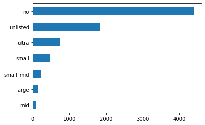   


About 4000 wallets (identified by address) have never received an ERC20 token. This is not surprising given that Ethereum and Bitcoin have such a dominant market share of the crypto market. Many investors do not have experience with these alternative coins. After 'no' comes unlisted tokens. Thse are tokens that don't have a listed value on CoinGecko. After comes ultra, small, small_mid, large, and then mid. 

There's no discenrable linear relationship between market cap of coin and liklihold of user receiving the coin. Given that there are far more unlisted coins (those with very low market cap values) it makes some sense that they are the predonominant holding. 


#### ERC20 Coins Sent
    

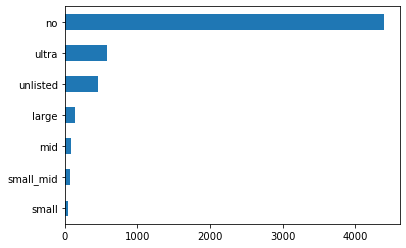


Compared to ERC20 tokens received, ultra is more common than unlisted to be sent from a wallet. If a wallet is sending, it is doing so for the purpose of exchanging for another cryptocurrency, gifting, or purchasing a good or service. Ultra may be more popular than unlisted because merchants are more likely to accept widely adopted cyrptocurrencies rather than low market cap value coins. 

-------

## Inspect Correlation

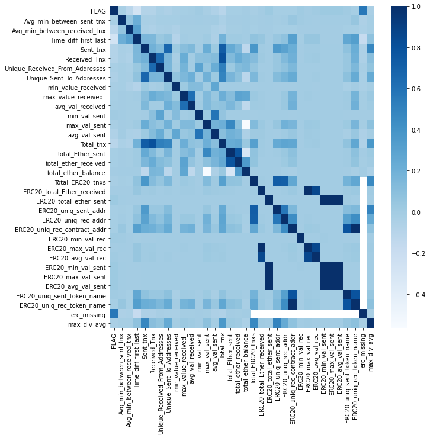
    


- In general, the variables do not have much correlation with each other
- What stands out is that ERC statistics have lower than average correlation with non-ERC statistics of the same measurement

-------

 

# MODEL

Based on our EDA and goal of the model, I will build a K-Nearest Neighbors model and Random Forest model. The dataset has many outlier values and random forests do a good job of handling outlier values.

The purpose of the model is to accurately predict fraudulent transactions. I am prioritizing recall over other evaluation metrics because the cost of false negative is greater than the cost of false positive. If a customer receives a notification for potential fraud that is not fraud, there is a little harm. If the model suspects fraud, but does not notify the customer because it is more focused on precision, the damages are higher. Can quanitify the value of the model by seeing how it compares to a dummy model, and then calculating how much in ether it would have saved if it notified customers of fraud. 

60% of the crypto market share is in either Bitcoin or Ethereum. Bitcoins controls 40% of the market share, Ethereum 20%, and the next largest coin controls 2.5% of the market share. The model predicts fraud in ETH and ERC20 transactions. Since ETH controls a large market share in the crypto space, this model is broad reaching.


## Dummy Baseline Model
- Compare to final model to see how well it performs
- Simply predicts target based on mean


```

    **************CLASSIFICATION REPORT***************
                  precision    recall  f1-score   support
    
           valid       0.79      0.51      0.62      2299
           fraud       0.23      0.52      0.32       646
    
        accuracy                           0.51      2945
       macro avg       0.51      0.52      0.47      2945
    weighted avg       0.67      0.51      0.55      2945
    
    *******************************************************

    Recall training score: 0.50178
    Recall test score: 0.51273
    Underfit by --0.01095
    ---------------
 ```   
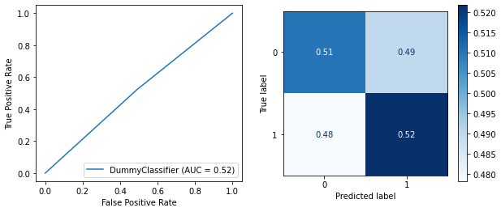

- Fraudulent recall score was 0.52, this is our most important classifier
- Out of all fraud cases, the model accurately predicted 52% of them
- Goal of future models to boost recall score of fraud (1)
- The model is underfit

## K-Nearest Neighbors Model
- Assumptions: Data is scaled
- Begin with vanilla model and then tune using feature selection and GridSearchCV

 ```
    ****************CLASSIFICATION REPORT*************
                  precision    recall  f1-score   support
    
           valid       0.98      0.96      0.97      2299
           fraud       0.88      0.92      0.90       646
    
        accuracy                           0.96      2945
       macro avg       0.93      0.94      0.94      2945
    weighted avg       0.96      0.96      0.96      2945
    
    ******************************************************

    Recall training score: 0.98089
    Recall test score: 0.95586
    Overfit by +0.02503
    ---------------
    Recall score improvement: +0.40415
``` 


- The KNN F1 scores and recall scores jumped significantly from the dummy model
- AUC score is 0.97, almost at 1.00, the max
- Out of all fraud cases, the model accurately predicted 92% of them
- **Next:** Perform feature selection to try and optimize recall

------------

#### Testing for Feature Selection


A significant amount of my features are low variance because it takes a high threshold (compared to rule of thumb of 0.01) to remove just 30% of my features (0.2 threshold would achieve this). Looks like the optimal tradeoff between feature removal and threshold is between 0.01-0.05


```
****************CLASSIFICATION REPORT*************
                  precision    recall  f1-score   support
    
           valid       0.98      0.97      0.97      2299
           fraud       0.88      0.93      0.90       646
    
        accuracy                           0.96      2945
       macro avg       0.93      0.95      0.94      2945
    weighted avg       0.96      0.96      0.96      2945
    
******************************************************

Recall training score: 0.98089
Recall test score: 0.95654
Overfit by +0.02435
---------------
Recall score improvement: +0.40569999999999995
```


- Features have been removed and recall score has gone up which is the metric we are looking to optimize
- Recall score improved from 0.92 to 0.93
- Dropped 'weights_rec_mid', 'weights_sent_mid' 'weights_sent_small', 'weights_sent_small_mid'

---------

### KNN Tuning

- Prioritizing recall because cost of false positive is low but cost of false negative is very high
- Sacrafising a balance of F1 to achieve a higher recall score
- Test out various hyperparamaters in an interative fashion to find the model that produces the highest recall score


```
    ****************CLASSIFICATION REPORT*************
                  precision    recall  f1-score   support
    
           valid       0.98      0.98      0.98      2299
           fraud       0.94      0.92      0.93       646
    
        accuracy                           0.97      2945
       macro avg       0.96      0.95      0.95      2945
    weighted avg       0.97      0.97      0.97      2945
    
    *******************************************************

    Recall training score: 1.0
    Recall test score: 0.96808
    Overfit by +0.03192
    ---------------
    Recall score improvement: +0.39640999999999993
```


    


### KNN Conclusions
- Overall, compared to the dummy, the KNN model performed very well on the training and test set
- In the dummy, the model detected fraud 52% of the time, in the final KNN model, it was able to accurately detect fraud 92% of the time, a 40% improvement
- Out of all valid transactions, it accurately predicted 98%
    - Of the 2% that are misclassified, the only harm is that the customer will receive a notification saying that the transaction they are initiating may be fraudulent
    - They can confirm or deny this and proceed to send the funds
- For fraudulant cases, the median of the average value sent in a transaction is 0.5 ETH. The 200 moving day average (the average price of ETH the past 200 days) is \$1,528
    - While there is no official number, BTC and ETH have clearly been the target of hacks and we shall say that 5% of all wallets will be hacked at some point in existance
    - If a wallet service has 10,000 users, it can expect 500 of them to experience some sort of fraud. Given that the median average value sent out per accounts that experience fraud is 0.5 ETH, these customers are losing \$764
    - The dummy model can predict fraud 50% of the time. So 250 people will experience fraud costing them \\$764 each for a total loss of \$191,000
    - Of course, this is bad business for the wallet company, the users are highly likely to transfer their funds to another wallet service after experiencing fraud
    - If the company were to use the KNN model that we have tuned, it would detect fraud 92% of the time
        - Out of the 500 customers who would hypothetically experience fraud, only 40 customers would experience fraud because the model would notify the customer before sending the suspicious transaction
        - 40 customers causes a total loss of $30,560
- **Conclusion**: Out of 10,000 customers, the company can expect that 500 of them will be targeted for fraud. Using the model, rather than 250 of them being impacted by fraud, only 30 of them will be
    - This reduces potential losses from \$191,000 to \$30,560, an 84% decrease in costs
    - Additinally, 88% fewere customers will be affected by fraud
    - The average expected loss by fraud is reduced from \$19.11 to \$3.05

-----------

## Random Forest Model
- Using the Random Forest model because it is more resistant to variance and outliers
- Ensemble method so in theory it should provide strong results
- Still interpretable and can provide conclusions


### Vanilla RFM

- Evaluate performance of Vanilla RFM to get a baseline how the model is performing
- KNN vanilla performance was ~91% recall on the fraud (1) cases

```

    *************CLASSIFICATION REPORT ****************
                  precision    recall  f1-score   support
    
           valid       0.98      1.00      0.99      2299
           fraud       0.99      0.93      0.96       646
    
        accuracy                           0.98      2945
       macro avg       0.99      0.96      0.97      2945
    weighted avg       0.98      0.98      0.98      2945
    
    *******************************************************


```
    
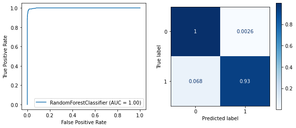   


    Recall training score: 1.0
    Recall test score: 0.98302
    Overfit by +0.01698
    ---------------
    Recall score improvement: +0.41189


- The model had a recall on the fraud test data of 93%
    - Out of 100 fraudulent transactions, the model was able to accurately detect 93% of them
- The model is very slightly slightly overfit, about 1.5%
- Recall score moved up about 41% compared to the dummy variable
- Optimizing for Fraud Recall, because very high cost of false negatives
- AUC score is 1.0 which is the maximum score
- Vanilla RFM is already performing as well as the top KNN model
- **Next Steps:** Use Feature Selection to try and optimize recall score 

### RFM Feature Selection

- Use a combination of feature selection and Permuation Importance to filter out unncessary columns
- Permutation Importance is not a tool for feature selection but it classifies which variables have a large impact on recall (if specified)
- Before dropping columns based on Feature Importance, ensure that columns are not making a signficant impact on recall score
- Filtering out columns may improve recall score because there may be less confounding variables

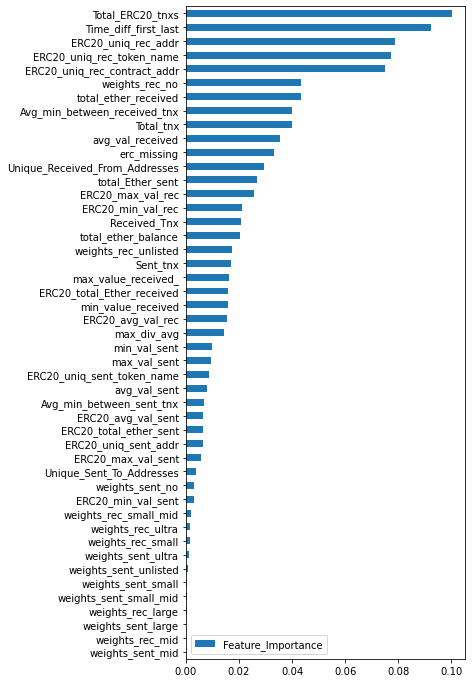
    


- Feature important tells us how important a variable is for predicting a target
- The maximum feature importance is 0.10
- Total_ERC_20_tnxs, time_diff_first_last, ERC20_uniq_rec_token_name, ERC20_uniq_rec_contract_address
- After ERC20_uniq_rec_contract_address the feature importance dips from aprox 0.08 to aprox 0.04


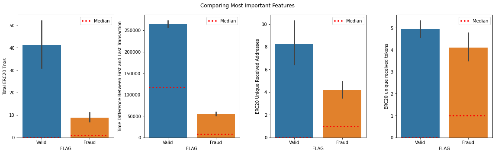    


- Total ERC20 Tnxs: As we can see, the mean for total ERC20 tnxs is about 4x higher for valid versus fraudulent wallets
- Time difference between first and last transaction: On average, valid transactions have about a 5x higher time difference between first and last transactions
    - Equates to about 150 days to 30 days
- ERC20 Unique Received Addresses: About 2x as high for valid versus fraudulent wallets
- ERC20 Unique Received Tokens: Roughly the same, valid is slightly higher
- Overall, interesting to note that many of the top features for model classification are regarding ERC20 transactions as opposed to standard Ethereum transactions
- The median gives us a sense that the distribution contains lots of outliers


    

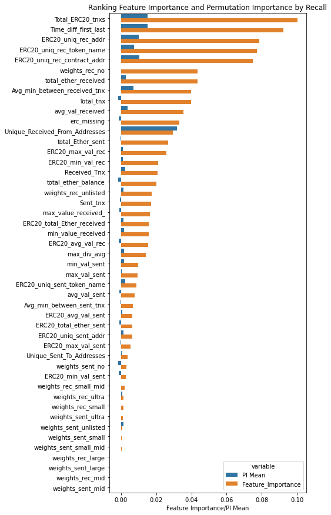
    


- The top columns in feature selection are also the top columns for Permutation Importance when focusing on recall
- Unique received from address has the most disparity between importance levels
- A few of the features have a negative impact on recall
- In general, the magnitude of PI is much lower than the RF Feature Importance
- Out of 47 columns, will try dropping 20% and see if my model has a major difference in performance
    - Equates to 10 columns
    - Compare score before and after drop


----------

# Evaluate model with selected features removed

```

    **************CLASSIFICATION REPORT****************
                  precision    recall  f1-score   support
    
           valid       0.98      1.00      0.99      2299
           fraud       0.99      0.94      0.96       646
    
        accuracy                           0.98      2945
       macro avg       0.98      0.97      0.98      2945
    weighted avg       0.98      0.98      0.98      2945
    
    *******************************************************

    Recall training score: 1.0
    Recall test score: 0.9837
    Overfit by +0.0163
    ---------------
    Recall score improvement: +0.41808

```
- Recall score on the testing data has improved to 94%, this is the metric we are trying to optimize
- Vanilla test recall on the fraud column was at 93%
- Removing columns improved the score
- These columns may have negatively impacted recall score
- Additionally, with less columns, we are improving computational efficiency
-----

### RFM Tuning

- Use GridSearch CV to optimize for recall
- Iterate this process until optimal model is found


```

```

    ***************CLASSIFICATION REPORT*****************
                  precision    recall  f1-score   support
    
           valid       0.99      0.99      0.99      2299
           fraud       0.97      0.96      0.97       646
    
        accuracy                           0.99      2945
       macro avg       0.98      0.98      0.98      2945
    weighted avg       0.99      0.99      0.99      2945
    
    *******************************************************


    


    Recall training score: 0.9952
    Recall test score: 0.98574
    Overfit by +0.00946
    ---------------
    Recall score improvement: +0.4444


- After iterating through different types of grid searches, the model is detecting 96% of fraudulant cases
- Out of valid cases, it is accurately classifying 99% of them
- AUC curve is still at max value of 1.0


### RFM Conclusion

- The Random Forest Model is the best model I have created for optimizing for recall for fraudulant transactions
- The Random Forest outperforms the KNN model by about 4% on the test case
- The Random Forest outperforms the dummy model by about 45%
- In final performance out of all fraudulant cases, only ~3% would pass through the model undetected. Out of all valid transactions, the model would only miscategorize 1% of them fraud, this cost is low
    - For fraudulant transactions, it accurately classifies ~96% of them
    - For valid transactions, it accurately classifies ~99% of them
- If a wallet company implemented this model into its infrastructure, it would greatly improve customer satisfaction because customers know that their marginal transaction has a very liklihood of being accurately classified as fraudulant or valid. This gives them more confidence in the wallet
- Similar to the KNN interpretation, say a crypto wallet start up has 10,000 users and knows that over the course of the wallets lifetime, 500 will be targeted for fraud. The average fraudulant Ethereum transaction is 0.5 ETH (~\$764) 
    - In the dummy model, 500 customers are targeted for fraud and 250 are succesfully defrauded costing customers a total of \$191,000
    - In the KNN model, 500 customers are targeted for fraud and 40 are succesfully defrauded costing customers a total of \$30,560
    - In the RF model, 500 customers are targeted for fraud and only 19 are succesfully defrauded costing customers a total of \$14,516
        - For 10,000 customers, fraud's **expected cost per customer is reduced from \\$19.11 to \\$1.55**


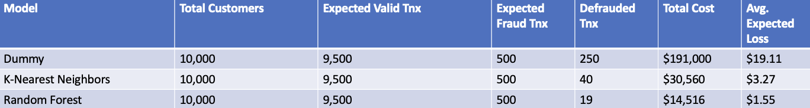


# Intepretation

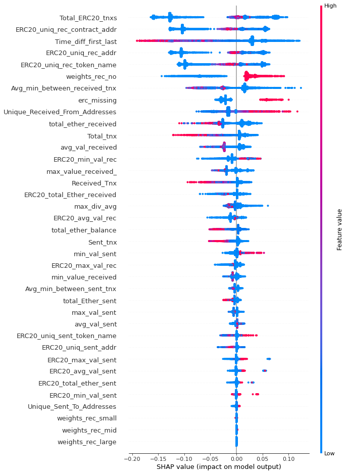
    

- Total ERC20_tnx, ERC20_unique_rec_token_name, ERC20_unique_rec_address are difficult to tell which direction they are moving the prediction based on the SHAP Model
    - From EDA and cross-referencing LIME, it appears that:
        - The more active the user is in making transactions, the higher the liklihood that the wallet will be defrauded
- Time_diff_first_and_last tend to be associated with mixed values
    - Low values seem to be more correlated with fraud
- If ERC values are missing, there is a very high liklihood of fraud
    - Makes sense because the user may not know what transactions transpired in their wallet
- If a user does use ERC20 tokens, they are less likely to experience fraud
    - This is very surpising considering many ERC20 tokens are associated with fraud
- Higher the total ether balance, less likely to report fraud
    - Wallets with higher balances may be more heavily targeted but they the owners may be more vigilant

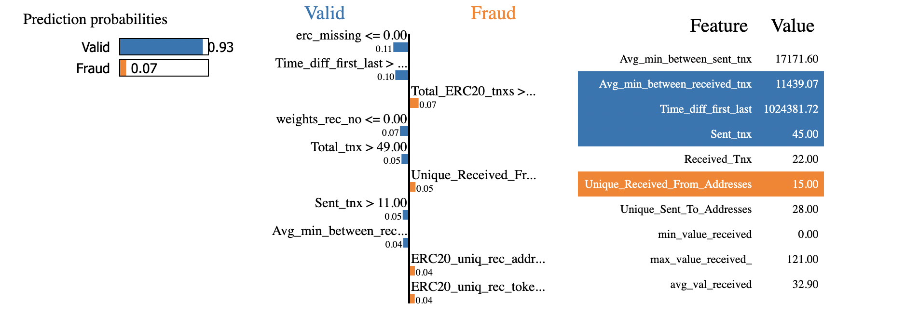


- A greater time difference between first and last transaction results in a higher probability of a valid transaction
    - This is a proxy for how long the wallet has been in existance, the longer the wallet has been available, the less liklihood that it will be defrauded. This may be biased by the fact that once a wallet is defrauded, users are likely to get rid of it
- If ERC information is missing, the wallet is more likely to be defrauded
    - After a fraudulant transaction, data may not be available for the transaction that took place
- If a wallet holds ERC20 tokens, it is less likely to be defrauded
- The more ERC20 tnxs, the most unique received tokens, and the more unique received from addresses,the high likelihood for fraud


# CONCLUSIONS & RECOMMENDATIONS

The cryptocurrency industry feels like it is close to making a full break through into the mainstream. The market has evolved from fringe useage in the early 2010s [selling 10,000 BTC for 2 large Dominoes pizzas](https://www.coindesk.com/bitcoin-pizza-10-years-laszlo-hanyecz) to total retail hype in 2017. The market was relatively quite from 2017 to 2019 and absolutely exloded in value in 2020 when institutions began to adopt Bitcoin as a store of value (similar to gold). There have been moments of hype scattered between and plenty of interesting stories but that's the most basic gist.

From the retail perpsective, the two majors complaints against crypto are, 'what can I buy with it?' and 'why is it worth something?'. In my opinion, once retail useage picks up as a method of payment and store of value, the question becomes, 'how do I know it's safe?'  

The purpose of the model I have built is to make retailers feel safe about their transactions. People feel comfortable using credit cards to spend money because they know if something unintended happens, they can probably get their money back after speaking with customer service for 30 minutes. Unfortunately, in the crypto space, once your money is sent out of your wallet, there's no getting it back. This is exactly why technologies need to advance so customers can feel comfortable using their crypto for transactions.

Since liability is purely on the user, the next best solution is to build a model that can predict with a high level of accuracy whether the marginal wallet transactions is valid or fraudulant. If the model feels the wallet is at risk, it can ping the user and let them know to be careful before releasing the funds. Safeguards like these will never be perfect, but as more data is released, they can get smarter and smarter. The model learns from features like time between first and last transaction, the size of the transactions, and the types of coins that the wallet holds. 

Currently, the Random Forest Model that I have produced has an accuracy of 98%. More importantly, it has a recall of ~96%. For every 100 fraudulant transaction, it correctly classifies 96 of them. For every 100 valid transactions, it correctly classifies 99 of them. The median average transaction for fraudulant transactions is 0.5 ETH (\$764). Customers are putting a lot of faith into wallet providers and money is on the line. If the wallet company has to compete for market share, this type of service would be a crucial value-add. 

Ideally, wallet providers will be able to easily integrate their products with a production level model to improve security and customer satisfaction. It is a win-win. 


---------

For more information please see the corresponding [Jupyter Notebook](https://github.com/kuninethan95/OSEMN/blob/master/index_OSEMN.ipynb) or email kunin.ethan95@gmail.com

```
├── README.md               <- The top-level README for reviewers of this project.
├── index.ipynb             <- narrative documentation of analysis in jupyter notebook
├── presentation.pdf        <- pdf version of project presentation
└── images
    └── images               <- both sourced externally and generated from code
└── data
    └── 
```
